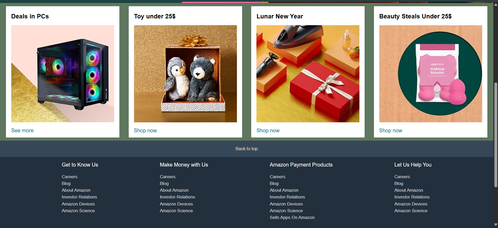

# 🛍️ Amazon Landing Page Clone

This is a **responsive clone** of the Amazon homepage, built using only **HTML** and **CSS**. The project is aimed at understanding the structure, layout, and styling techniques used in large-scale e-commerce platforms like Amazon.

---

## 🌐 Live Preview

> You can open the `index.html` file in your browser to view the page.

---

## 🧰 Technologies Used

- **HTML5**
- **CSS3 (Flexbox, Grid, Media Queries)**

---
## SCREENSHOTS

## 🎯 Features

- 🖼️ Banner section with promotional images  
- 📦 Product category cards with hover effects  
- 📱 Fully **responsive design** for mobile, tablet, and desktop  
- 📂 Organized file structure (HTML, CSS, image assets)

---

## 📁 Folder Structure

